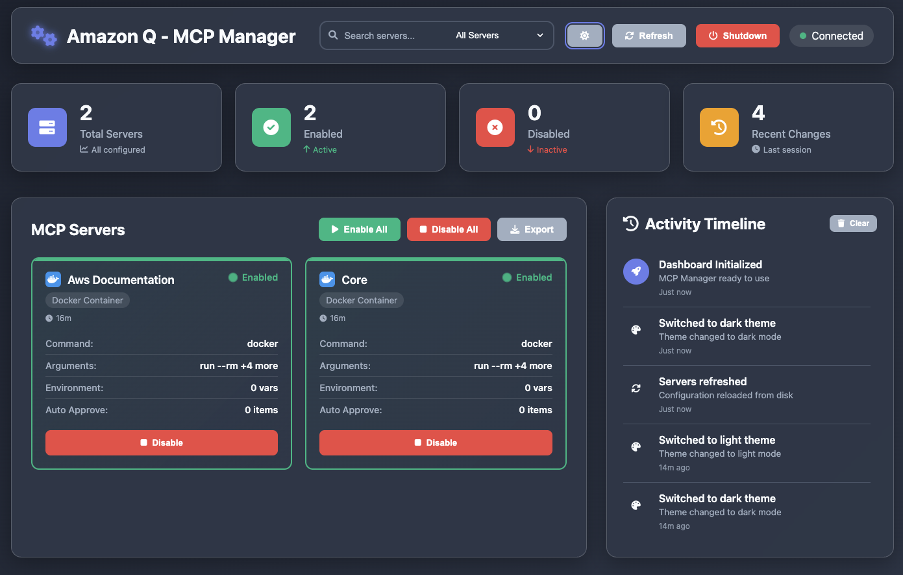

<div align="center">

# Amazon Q - MCP Manager Dashboard

</div>

A modern, responsive web-based dashboard for managing Amazon Q MCP (Model Context Protocol) servers on macOS. This dashboard allows you to easily view, enable, and disable MCP servers configured in your `~/.aws/amazonq/mcp.json` file.

## Features

- 🎛️ **Dashboard Overview**: View all configured MCP servers at a glance
- 🟢 **Status Indicators**: Green/red lights showing enabled/disabled status
- ⚡ **Quick Actions**: Enable/disable individual servers or all servers at once
- 📊 **Statistics**: Real-time stats showing total, enabled, and disabled servers
- 🔄 **Auto-sync**: Automatically reads and writes to your MCP configuration file
- 📱 **Responsive Design**: Works perfectly on desktop, tablet, and mobile
- 🎨 **Modern UI**: Clean, intuitive interface with smooth animations
- 🔒 **Safe Operations**: Creates backups before making changes
- ⌨️ **Keyboard Shortcuts**: Quick access via keyboard shortcuts

## Screenshots

### Light Mode
The clean, modern interface with glassmorphism design and intuitive controls:


### Dark Mode
The sleek dark theme with enhanced visual contrast and modern aesthetics:



### Dashboard Walkthrough

Based on the screenshots above, here's what you'll find on the dashboard:

#### 🎛️ **Header & Controls**
- **Dashboard Title**: "MCP Manager Dashboard" with elegant typography
- **Theme Toggle**: Sun/Moon icon in the top-right to switch between light and dark modes
- **Refresh Button**: Reload server configurations from your MCP file
- **Server Statistics**: Live count showing "Total: 4, Enabled: 2, Disabled: 2"

#### 📊 **Server Management Grid**
Each server is displayed as an individual card containing:
- **Server Name**: Clearly labeled (e.g., "filesystem", "brave-search", "mcp-server-git", "postgres")
- **Server Type Badge**: Visual indicator showing the type (Docker, Python, Node.js, etc.)
- **Status Indicator**: Green dot (enabled) or red dot (disabled) with animated pulse
- **Command Preview**: Shows the actual command that will be executed
- **Enable/Disable Toggle**: Individual button to control each server
- **Server Details**: Environment variables, arguments, and configuration info

#### ⚡ **Bulk Operations Panel**
- **"Enable All" Button**: Activate all MCP servers with one click
- **"Disable All" Button**: Deactivate all servers simultaneously
- **Operation Feedback**: Toast notifications confirm successful actions

#### 📈 **Real-Time Activity Timeline**
- **Activity Log**: Shows recent actions with timestamps
- **Action Types**: Server enabled/disabled, configuration refreshed, etc.
- **Time Stamps**: Precise timing of each operation (e.g., "3:28:45 PM")
- **Operation Success**: Visual confirmation of completed actions

#### 🎨 **Visual Design Elements**
- **Glassmorphism Cards**: Semi-transparent cards with backdrop blur effects
- **Gradient Background**: Beautiful blue-to-purple gradient backdrop
- **Smooth Animations**: Hover effects and transitions on interactive elements
- **Typography Hierarchy**: Clear information hierarchy with varied font weights
- **Color-Coded Status**: Intuitive green/red system for server states
- **Responsive Layout**: Grid system that adapts to different screen sizes

#### 🔧 **Practical Use Cases**
The dashboard enables you to:
1. **Quick Server Overview**: See all MCP servers and their status at a glance
2. **Individual Control**: Enable or disable specific servers as needed
3. **Bulk Management**: Turn all servers on/off for testing or maintenance
4. **Configuration Monitoring**: Track changes and verify server states
5. **Activity Tracking**: Review what changes were made and when
6. **Theme Preference**: Choose your preferred visual mode for comfort

## Prerequisites

- macOS with Amazon Q CLI installed
- Node.js (version 14 or higher)
- MCP configuration file at `~/.aws/amazonq/mcp.json`

## Installation

1. **Clone the repository**:
   ```bash
   git clone https://github.com/YOUR_USERNAME/q-mcp-manager.git
   cd q-mcp-manager
   ```

2. **Install dependencies**:
   ```bash
   npm install
   ```

3. **Verify your MCP configuration exists**:
   ```bash
   ls -la ~/.aws/amazonq/mcp.json
   ```

## Usage

### 🚀 **Quick Start (Easiest)**
```bash
./start.sh start --background
```
✅ **Server starts + Dashboard opens + Terminal is free!**

### 🎛️ **Alternative Methods**

**Option 1: Direct server script**
```bash
./scripts/server.sh start --background
```

**Option 2: NPM command**
```bash
npm start
```

**Option 3: Development mode**
```bash
npm run dev
```

**To stop:** Click the red "Shutdown" button in the dashboard header.

### 📱 **Bookmark the Dashboard**
```
http://localhost:3000  # Default port
http://localhost:8080  # Custom port example
```

---

## Unified Server Control

All server operations use a single script: `./scripts/server.sh`

### 🔧 **Basic Commands**
- `./scripts/server.sh start [options]` - Start the server (auto-opens browser)
- `./scripts/server.sh stop [options]` - Stop the server gracefully
- `./scripts/server.sh restart [options]` - Restart the server
- `./scripts/server.sh status [options]` - Check server status and health
- `./scripts/server.sh logs [--follow]` - View server logs
- `./scripts/server.sh help` - Show all available commands

### 🌐 **Port Customization (NEW!)**
Run the dashboard on any port to avoid conflicts or match your preferences:

**Default port (3000):**
```bash
./scripts/server.sh start --background
```

**Custom port options:**
```bash
# Using --port flag
./scripts/server.sh start --port 8080 --background
./scripts/server.sh start -p 5000 --background --no-open

# Using --port= syntax  
./scripts/server.sh start --port=4000 --background

# All commands support custom ports
./scripts/server.sh status --port 8080
./scripts/server.sh stop --port 8080
```

**Port validation:**
- ✅ Ports 1-65535 are valid
- ⚠️ Ports below 1024 show privilege warning
- ❌ Invalid ports are rejected with clear error messages
- 🔍 Automatic port conflict detection

**Common use cases:**
- **Multiple instances**: Run dashboards for different projects on different ports
- **Avoid conflicts**: Use alternative ports when 3000 is occupied
- **Corporate networks**: Use non-standard ports to avoid firewall restrictions
- **Environment matching**: Match existing development port conventions

**Environment variable support:**
```bash
# Direct Node.js execution with custom port
PORT=8080 node src/backend/server.js

# NPM script with custom port
PORT=8080 npm start
```

**🌐 Auto-Open Feature**: The dashboard automatically opens in your browser when you start the server (use `--no-open` to disable)

📖 **For detailed server management instructions, see [docs/SERVER_GUIDE.md](docs/SERVER_GUIDE.md)**

### Managing MCP Servers
Once the dashboard is running:
- View all configured servers with their current status
- Click the Enable/Disable button on individual server cards
- Use "Enable All" or "Disable All" for bulk operations
- Click "Refresh" to reload the configuration from disk

## Keyboard Shortcuts

- `Ctrl/Cmd + R`: Refresh servers
- `Ctrl/Cmd + E`: Enable all servers
- `Ctrl/Cmd + D`: Disable all servers

## API Endpoints

The backend server provides the following REST API endpoints:

- `GET /api/mcp-config`: Read the current MCP configuration
- `POST /api/mcp-config`: Update the MCP configuration
- `POST /api/validate-config`: Validate a configuration before saving
- `GET /api/health`: Check server health status

## File Structure

```
q-mcp-manager/
├── src/
│   ├── backend/
│   │   └── server.js              # Express.js server
│   ├── frontend/
│   │   ├── dashboard/             # Main dashboard
│   │   │   ├── index.html
│   │   │   ├── script.js
│   │   │   └── styles.css
│   │   └── home/                  # Home launcher
│   │       ├── index.html
│   │       ├── script.js
│   │       └── styles.css
│   └── assets/                    # Static assets & screenshots
│       ├── launcher.html
│       ├── start.html
│       ├── Screenshot_1.png       # Light mode dashboard
│       └── Screenshot_2.png       # Dark mode dashboard
├── scripts/
│   └── server.sh                  # Main server control script
├── docs/
│   ├── QUICK_START.md             # Quick start guide
│   └── SERVER_GUIDE.md            # Detailed server guide
├── logs/                          # Server logs (auto-generated)
├── start.sh                       # Convenience startup script
├── package.json                   # Node.js dependencies
├── CONTRIBUTING.md                # Development guidelines
├── LICENSE                        # MIT License
├── README.md                      # This file
└── .gitignore                     # Git ignore rules
```

## Configuration File Format

The dashboard works with the standard Amazon Q MCP configuration format:

```json
{
  "mcpServers": {
    "server-name": {
      "command": "docker",
      "args": ["run", "--rm", "--interactive", "image:latest"],
      "env": {},
      "disabled": false,
      "autoApprove": []
    }
  }
}
```

## Safety Features

- **Automatic Backups**: Creates timestamped backups before making changes
- **Configuration Validation**: Validates JSON structure before saving
- **Error Handling**: Comprehensive error handling with user-friendly messages
- **Real-time Status**: Shows connection status and loading states

## Troubleshooting

### Server won't start
- Make sure Node.js is installed: `node --version`
- Check if port 3000 is available: `lsof -i :3000`
- Install dependencies: `npm install`

### Can't read MCP configuration
- Verify the file exists: `ls -la ~/.aws/amazonq/mcp.json`
- Check file permissions: `chmod 644 ~/.aws/amazonq/mcp.json`
- Validate JSON syntax: `cat ~/.aws/amazonq/mcp.json | jq .`

### Changes not taking effect
- Click the "Refresh" button to reload from disk
- Check the browser console for error messages
- Verify the backend server is running

## Development

To contribute or modify the dashboard:

1. **Frontend changes**: Edit `index.html`, `styles.css`, or `script.js`
2. **Backend changes**: Edit `server.js`
3. **Use development mode**: `npm run dev` for auto-reload

## Security Notes

- The dashboard runs locally on your machine
- Only accessible via localhost (not exposed to the internet)
- Creates backups before making any changes
- Validates all configuration changes before applying

## License

MIT License - feel free to modify and distribute as needed.

## Support

If you encounter any issues:
1. Check the browser console for error messages
2. Verify your MCP configuration file is valid JSON
3. Ensure the backend server is running on port 3000
4. Check file permissions on the MCP configuration file
